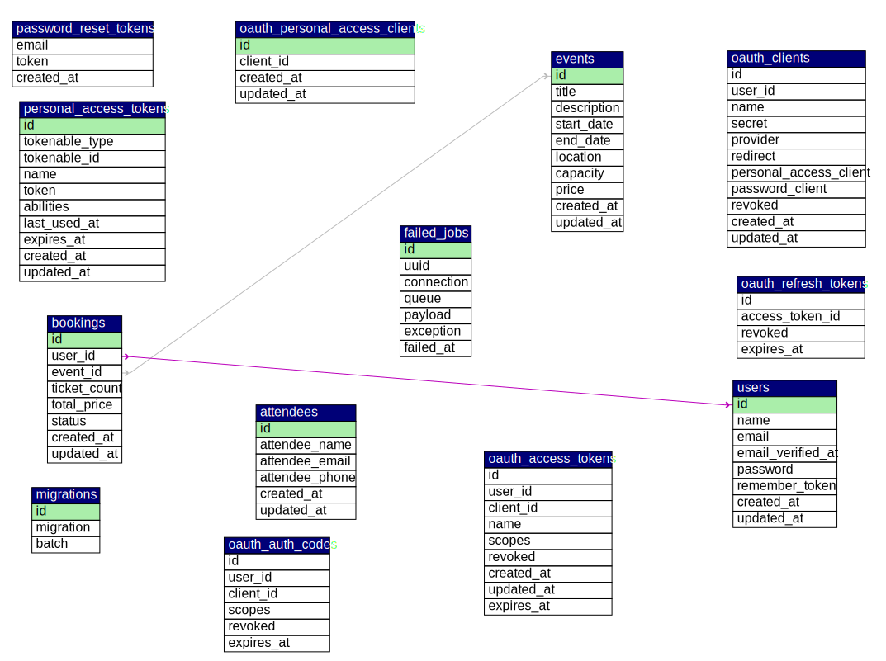

# Event-API
# Event Booking API - Laravel


A RESTful API for event management and booking system built with Laravel.

## Features

- User authentication (register, login, logout)
- CRUD operations for events
- Event booking system with capacity management
- User-specific booking history
- RESTful API design
- Sanctum API authentication

## Requirements

- PHP 8.0+
- Composer
- MySQL 5.7+
- Laravel 9.x

## Installation

1. Clone the repository:
```bash
git clone https://github.com/dipendrakumar2/Event-API
cd Event-API)
```

2. Install dependencies:
```bash
composer install
```

3. Create and configure the `.env` file:
```bash
cp .env.example .env
```

4. Generate application key:
```bash
php artisan key:generate
```

5. Run database migrations:
```bash
php artisan migrate
```

6. Install Laravel Sanctum:
```bash
composer require laravel/sanctum

php artisan vendor:publish --provider="Laravel\Sanctum\SanctumServiceProvider"

php artisan migrate

```

## API Endpoints

### Authentication

| Method | Endpoint       | Description          |
|--------|---------------|----------------------|
| POST   | /api/register | Register new user    |
| POST   | /api/login    | Login user           |
| POST   | /api/logout   | Logout user          |

### Events

| Method | Endpoint      | Description                     |
|--------|--------------|----------------------------------|
| GET    | /api/events  | List all events                 |
| POST   | /api/events  | Create new event (auth required) |
| GET    | /api/events/{id} | Get specific event details    |
| PUT    | /api/events/{id} | Update event (auth required)  |
| DELETE | /api/events/{id} | Delete event (auth required)  |

### Bookings

| Method | Endpoint                      | Description                          |
|--------|-------------------------------|--------------------------------------|
| GET    | /api/bookings                 | Get user's bookings (auth required)  |
| POST   | /api/events/{id}/bookings     | Book an event (auth required)        |
| GET    | /api/bookings/{id}            | Get booking details (auth required)  |
| DELETE | /api/bookings/{id}            | Cancel booking (auth required)       |

## Usage Examples

### POSTMAN Collection attached
## Database Schema



## Testing

Refer Postman Collection attached https://github.com/dipendrakumar2/Event-API/blob/main/Event-API.postman_collection.json

## License

This project is open-source and available under the [MIT License](LICENSE).

## TO DO
Serverless Notification Service Architecture 
A serverless notification system requires valid AWS access, but I currently don't have it.

